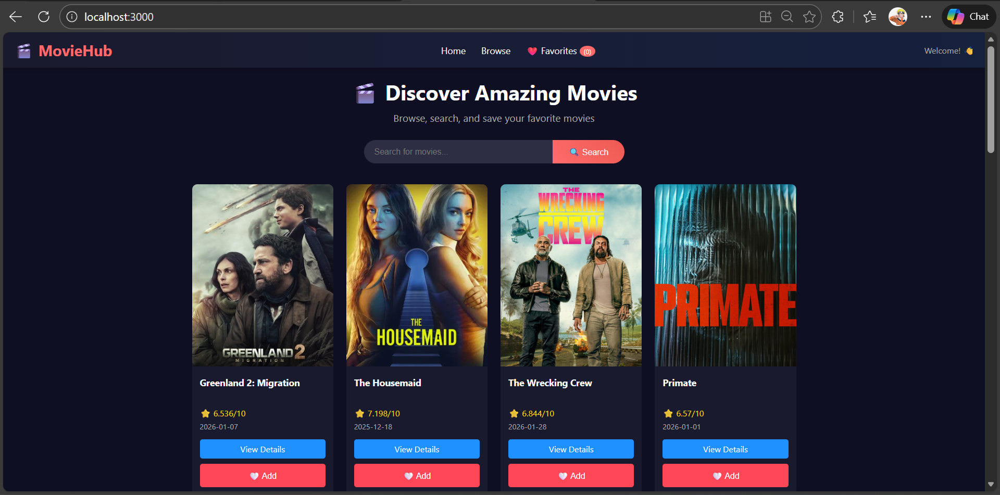
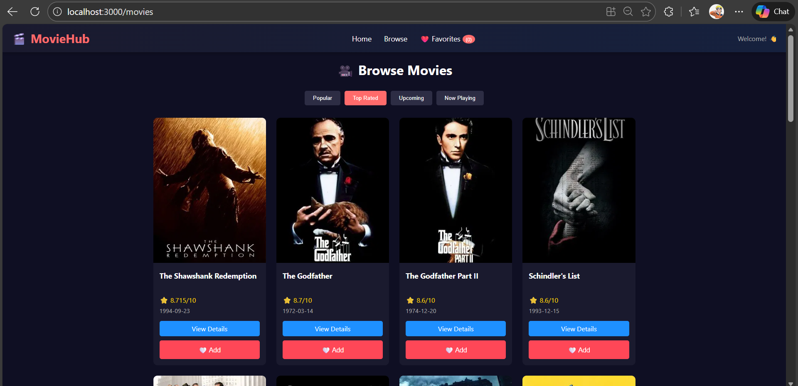
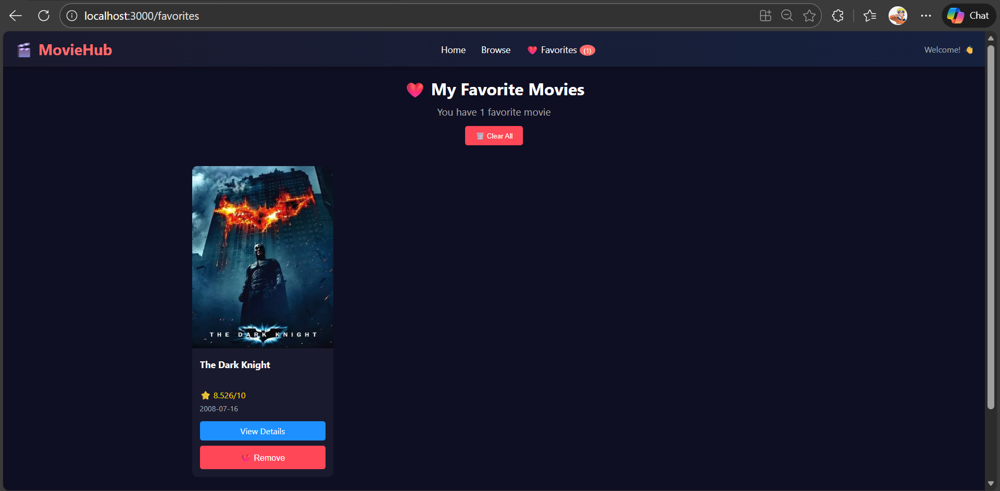

# 🎬 MovieHub - React Movie Discovery Application

      

🎯 Overview
MovieHub is a full-featured movie discovery web application that allows users to browse thousands of movies, search for specific titles, view detailed information, and curate a personal favorites collection. Built with modern React practices including functional components, hooks, Redux for state management, and React Router for navigation.

### Purpose: Demonstrate proficiency in:

React component architecture

Global state management with Redux Toolkit

Client-side routing with React Router

Third-party API integration

Responsive UI design

### 🔗 Live Demo: [View Live Demo](https://movie-hub-one-orcin.vercel.app/)

### 📸 Screenshots
### 🏠 Home Page

Browse popular movies with search functionality

### 🎥 Movie Details Page

View comprehensive movie information including synopsis, ratings, genres, and similar recommendations

### ❤️ Favorites Page

Manage your personal movie collection with Redux-powered favorites system

### ✨ Features
✅ Core Features

✅ Feature	Description	Status

✅ Browse Movies	View popular, top rated, upcoming, and now playing movies	

✅ Search	Real-time movie search with debouncing	

✅ Movie Details	Comprehensive movie information page	

✅ Favorites	Add/remove movies to personal collection	

✅ Persistent State	Favorites maintained via Redux store	

✅ Responsive Design	Mobile-first, works on all devices	

### 🔧 Technical Features
Dynamic Routing - Parameterized routes for individual movies

Global State - Redux Toolkit with slice architecture

Error Handling - Graceful fallbacks for API failures

Loading States - Skeleton loaders during data fetch

404 Page - Custom not-found handling

Environment Variables - Secure API key management

### 🛠️ Tech Stack
Frontend

Technology	Version	Purpose

React	18.2.0	UI library

React Router DOM	6.21.1	Navigation & routing

Redux Toolkit	2.0.1	State management

React Redux	9.0.4	React-Redux bindings

Axios	1.6.2	HTTP client

CSS3	-	Styling

APIs & Services

Service	Purpose

TMDB API	Movie database provider

Netlify	Hosting & continuous deployment

Development Tools

Tool	Usage

Create React App	Project scaffolding

ESLint	Code linting

Git	Version control

npm	Package management

### 📊 Data Flow
User navigates to /movies

Movies component fetches data from TMDB API via Axios

Response data stored in local useState

Data passed as props to MovieCard components

User clicks "Add to Favorites" → Redux action dispatched

Redux updates global state → All subscribed components re-render

Favorites count updates in Header, Favorites page shows new movies

### 📥 Installation
Prerequisites
Node.js (v16 or higher)

npm (v8 or higher)

TMDB API key

